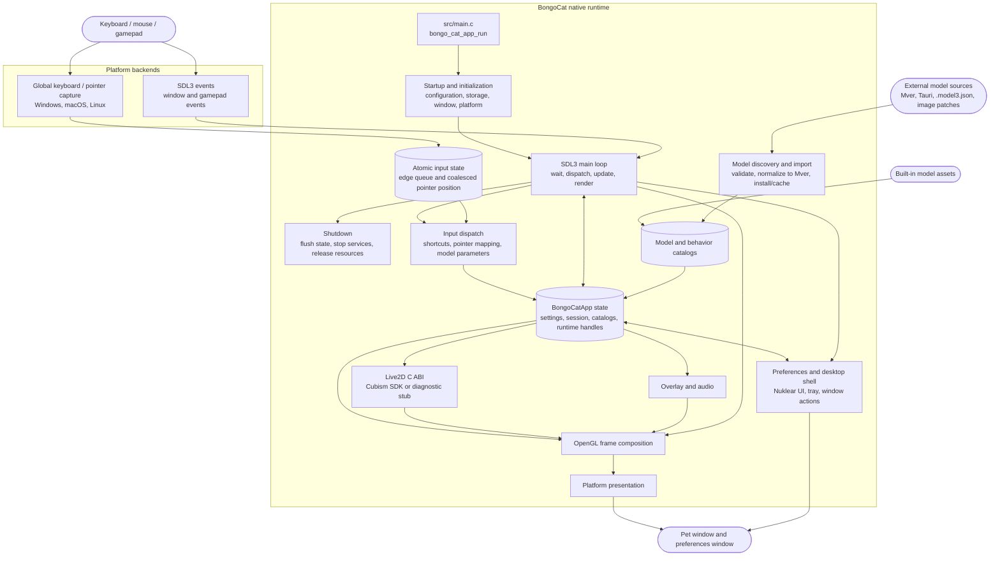

<div align="center">
  <a href="https://bongocat.pet" target="_blank">
    
  </a>
  
  <h1>
    <a href="https://bongocat.pet" target="_blank" style="text-decoration: none; color: inherit;">BongoCat</a>
  </h1>
</div>


<!-- Project Description + Rocket Icon -->
<p align="center"> 
 💘C × SDL3 × OpenGL — Three Mysterious Forces, United as One! Bong~ Bongocat!!!
</p>
<p align="center">
<a href="https://github.com/vladelaina/BongoCat/blob/main/README.md"><strong>English</strong></a> • <a href="https://github.com/vladelaina/BongoCat/blob/main/docs/README.zh-CN.md">简体中文</a> • <a href="https://github.com/vladelaina/BongoCat/blob/main/docs/README.zh-Hant.md">繁體中文</a> • <a href="https://github.com/vladelaina/BongoCat/blob/main/docs/README.fr-FR.md">Français</a> • <a href="https://github.com/vladelaina/BongoCat/blob/main/docs/README.de-DE.md">Deutsch</a> • <a href="https://github.com/vladelaina/BongoCat/blob/main/docs/README.ja-JP.md">日本語</a> • <a href="https://github.com/vladelaina/BongoCat/blob/main/docs/README.ko-KR.md">한국어</a> • <a href="https://github.com/vladelaina/BongoCat/blob/main/docs/README.pt-BR.md">Português</a> • <a href="https://github.com/vladelaina/BongoCat/blob/main/docs/README.ru-RU.md">Русский</a> • <a href="https://github.com/vladelaina/BongoCat/blob/main/docs/README.es-ES.md">Español</a> • <a href="https://github.com/vladelaina/BongoCat/blob/main/docs/README.id-ID.md">Bahasa Indonesia</a>
</p>
<p align="center">
  <a href="https://github.com/vladelaina/BongoCat/blob/main/LICENSE"></a>
  <a href="https://github.com/vladelaina/BongoCat"></a>
<a href="https://discord.gg/vf8jqnattk"></a>
  <a href="https://github.com/vladelaina/BongoCat/blob/main/docs/wechat.md"></a>
  <a href="https://qm.qq.com/q/cYlRBbvuda"></a>
</p>


<!-- Demo Video -->
<div align="center" style="margin-bottom: 30px;">
  <video src="https://github.com/user-attachments/assets/75719230-9e49-4124-ae5a-8e35592c5d49
" autoplay loop style="border-radius: 8px; max-width: 800px;"></video>
</div>


> [!TIP]
> The model featured in this demonstration is from [宇痕冫](https://space.bilibili.com/348616056).
>
> 🎁 Looking for **free** models? We work with talented model creators to bring you a wide variety of free models, while continuously exploring more fun desktop experiences! Visit our official website: [bongocat.pet](https://bongocat.pet/models)
<p align="center">
  <a href="https://bongocat.pet/models">
    
  </a>
</p>

<p align="center">
    
  </p>

## 📥 Download

<a href="https://apps.microsoft.com/detail/9p41mlsx72xw?referrer=appbadge" target="_self" >
	
</a>

- GitHub Releases

  Download the latest release from [GitHub Releases](https://github.com/vladelaina/BongoCat/releases/latest).

## 🛠️ Build From Source

BongoCat uses CMake and requires a C11 compiler, a C++17 compiler, CMake 3.24
or newer, and desktop OpenGL development files. SDL3, yyjson, stb, miniaudio,
and Nuklear are downloaded at configure time by default, so the first
configuration needs network access.

Run the commands below from the project root (the directory containing
`CMakeLists.txt`).

### 📋 Platform Prerequisites

- **Windows:** Visual Studio 2022 with the Desktop C++ workload and CMake.
  Use the MSVC generator; MinGW can build the diagnostic backend but is not
  supported for the Cubism SDK.
- **macOS:** Xcode Command Line Tools, CMake, and Ninja. Select an architecture
  with `CMAKE_OSX_ARCHITECTURES` when it differs from the host default.
- **Linux (Debian/Ubuntu):** GCC or Clang, Ninja, and the OpenGL/X11 headers:

  ```bash
  sudo apt-get update
  sudo apt-get install -y build-essential cmake ninja-build \
    libgl1-mesa-dev libx11-dev libxi-dev libxfixes-dev
  ```

### 🔧 Configure and Build

On Linux and macOS, use a single-configuration generator such as Ninja:

```bash
cmake -S . -B build -G Ninja \
  -DCMAKE_BUILD_TYPE=Release \
  -DBONGO_CAT_FETCH_DEPS=ON
cmake --build build --parallel
```

On Windows, run from a Visual Studio 2022 developer shell (or another shell
where MSVC is available):

```powershell
cmake -S . -B build -G "Visual Studio 17 2022" -A x64 `
  -DBONGO_CAT_FETCH_DEPS=ON
cmake --build build --config Release --parallel
```

The executable is written to `build/BongoCat` on Linux, to
`build/BongoCat.app/Contents/MacOS/BongoCat` on macOS, and to
`build/Release/BongoCat.exe` for Visual Studio builds.

### 📦 Linux Packages

From a Cubism-enabled Linux x64 build, create the optional release packages:

```bash
cmake --build build --target package-appimage
cmake --build build --target package-rpm
```

The RPM is written to `build/dist/` and requires `rpmbuild` on the build host.
Package-managed installations use the About update action to download the
matching release RPM, authorize `dnf install`, and restart the application.
The container helper can build and verify an EL9 package without installing
those tools locally:

```bash
bash .github/scripts/build-rpm-container.sh
bash .github/scripts/check-rpm.sh build-rpm-el9/dist/*.rpm
```

### 🧪 Tests

CTest targets are enabled by default. Run them after building:

```bash
ctest --test-dir build --output-on-failure
```

For a multi-configuration generator such as Visual Studio, select the build
configuration explicitly:

```powershell
ctest --test-dir build -C Release --output-on-failure
```

### 🎭 Live2D / Cubism SDK (Optional)

If the Cubism SDK is not present, CMake emits a warning and builds the
diagnostic backend. This backend is intended for startup and platform
diagnostics; it does not provide Live2D model rendering. To build the full
runtime, install a compatible Cubism SDK for Native and either place it at
`vendor/CubismSdkForNative` or pass its location explicitly:

```bash
cmake -S . -B build -G Ninja \
  -DCMAKE_BUILD_TYPE=Release \
  -DBONGO_CAT_CUBISM_SDK=/path/to/CubismSdkForNative \
  -DBONGO_CAT_REQUIRE_CUBISM=ON
```

The SDK must contain its Core library, Framework sources, and the OpenGL GLEW
third-party tree in the layout expected by `cmake/Cubism.cmake`. Windows
Cubism builds require Visual Studio 2022. `BONGO_CAT_REQUIRE_CUBISM=ON` makes
configuration fail instead of silently selecting the diagnostic backend.

### ⚙️ CMake Options

| Option | Default | Description |
| --- | --- | --- |
| `BONGO_CAT_FETCH_DEPS` | `ON` | Download the pinned third-party dependencies with CMake `FetchContent`. Set `OFF` only when SDL3, yyjson, stb, miniaudio, and Nuklear are already available to CMake. |
| `BONGO_CAT_CUBISM_SDK` | `vendor/CubismSdkForNative` | Path to the Cubism SDK for Native. |
| `BONGO_CAT_REQUIRE_CUBISM` | `OFF` | Fail configuration when a usable Cubism SDK is unavailable. |
| `BONGO_CAT_WARNINGS_AS_ERRORS` | `OFF` | Treat native compiler warnings as errors. |

For an offline build with `BONGO_CAT_FETCH_DEPS=OFF`, provide CMake package
configurations for SDL3 (including `SDL3-static`) and yyjson, plus the include
directories for stb, Nuklear, and miniaudio when they are not discoverable:

```bash
cmake -S . -B build -G Ninja \
  -DCMAKE_BUILD_TYPE=Release \
  -DBONGO_CAT_FETCH_DEPS=OFF \
  -DBONGO_CAT_STB_INCLUDE_DIR=/path/to/stb \
  -DBONGO_CAT_NUKLEAR_INCLUDE_DIR=/path/to/nuklear \
  -DBONGO_CAT_MINIAUDIO_INCLUDE_DIR=/path/to/miniaudio
```

## 📌 Project Status


## 📜 License

The BongoCat source code and native runtime are licensed under
[AGPL-3.0-only](LICENSE).

The default built-in model mode (`standard`) remains MIT-licensed. The
bundled model assets in `resources/assets/models/standard`, `keyboard`, and
`gamepad` are covered by the separate [MIT license notice](LICENSE-MIT).
That MIT license applies to the model assets and their accompanying artwork
only; it does not relicense the BongoCat source code or native runtime.


## 🧭 Technical Architecture

> The current native version is built on C/C++, SDL3, and OpenGL. The diagram below focuses on the runtime data flow; build and packaging details live in CMake.

### 🔄 Runtime Ownership and Frame Scheduling

Each process owns one `BongoCatApp` and one main-thread event and render loop.
Platform listeners stop at the input boundary:

```text
Platform listeners
(keyboard / pointer)
            |
            v
  C11 input state
  (atomic edge queue + coalesced pointer position)
            |
            v
  main-thread application <----- SDL3 events
            |
            v
  model parameters, overlay, and UI state
            |
            v
  model update -> OpenGL composition -> platform presentation
```

The Windows Raw Input receiver, macOS Quartz event tap, and Linux XInput2 listener
run outside the main loop. They publish timestamped key and mouse-button edges
to the bounded atomic queue and coalesce pointer motion separately, so frequent
motion cannot displace ordered key and button edges. Native SDL wake events
notify the main thread. Windows registers a message-only receiver for background
keyboard and mouse input with `RIDEV_INPUTSINK | RIDEV_DEVNOTIFY`, preserving legacy
window messages. Device motion drives the model when another application hides
or locks the cursor; SDL supplies the desktop cursor position. The receiver
tracks held inputs per device and clears them on device removal or desktop
switches. It does not install input hooks, use DirectInput, or send input to games.
SDL3 window, preferences, and gamepad events
are handled on the main thread, where gamepad events are normalized before they
reach model parameters or shortcuts. No platform listener calls Live2D,
overlay, or UI code directly.

`bongo_cat_app_run` handles update-shutdown and secondary-process arguments,
enforces single-instance ownership for the primary process, allocates the
application state, runs initialization, enters `bongo_cat_app_loop`, and then
flushes state and destroys resources in a defined order. Initialization loads
configuration and storage paths, locates assets, creates the SDL/OpenGL pet
window, initializes the platform backend, creates the Live2D, overlay, and
audio services, scans the built-in/installed/nearby model sources, and loads a
usable model. `BongoCatApp` owns settings, session state, model and behavior
catalogs, platform handles, and runtime service handles.

Installed model packages use Mver as the canonical format. The import workflow
resolves a selected file or directory, discovers and validates candidates,
fingerprints package identity, converts Tauri sources to Mver, applies image
patches, and commits the normalized package under `models_root`. It then
generates the runtime adapter and refreshes the catalogs. Nearby sources are
discovered without installing their source tree; their adapters and inspection
results are cached outside `models_root` under `cache_root`.

Each main-loop iteration waits for SDL/native wakeups or the earliest pending
frame, UI, animation, or pointer-hit deadline (with a maximum wait of 250 ms).
It dispatches queued SDL events, drains the atomic input queue and release
recovery, updates window and model-refresh state, and applies input-derived
parameters. With Cubism enabled, the model deadline follows
`settings.model.max_fps` (60 FPS by default); diagnostic builds use a 100 ms
fallback interval. The elapsed model time is capped at 250 ms and split into up
to eight substeps, targeting no more than 1/30 s per substep.

The normal pet path renders only when the window is visible, not minimized, and
marked dirty. A frame clears the background, draws the model, and composites
pointer, key, and effect overlays before calling the platform presenter.
Preview operations can request immediate renders, while capture renders may
skip presentation. macOS and Linux swap the SDL OpenGL window directly.
Windows swaps directly when layered presentation is inactive and otherwise
reads back the frame for `UpdateLayeredWindow`. The preferences UI owns a
separate SDL/OpenGL window and is rendered and presented independently from
the pet window.

The C runtime calls the ABI declared in `include/bongo_cat/model.h`. The Live2D
bridge and Cubism implementation live in `src/live2d` and use C++17 only when
the Cubism SDK is enabled; the rest of the native runtime uses C11. Cubism
types remain behind opaque C handles, while `src/live2d/live2d_stub.c` provides
the diagnostic backend when the SDK is unavailable.




## ❓ FAQ

### 🔒 Does BongoCat record my keyboard or mouse input?

No. BongoCat processes keyboard and mouse input locally to drive animations
and shortcuts. It does not record or upload your keystrokes, mouse actions, or
other interaction data. Configuration is stored locally as well, and the app
contains no ads, analytics tools, or user-tracking code. When an update check
is performed, it only requests public release metadata; it does not send input,
configuration, or usage data.

### Linux Wayland Input

X11 uses XInput2 by default. Experimental evdev input for Wayland is off by
default. After reviewing [the input permission risks](SECURITY.md#linux-input),
it can be explicitly selected for one launch:

```sh
BONGOCAT_ENABLE_EVDEV=1 ./build/BongoCat
```

This does not grant device permissions. Do not run the app as root or add
your account to the `input` group to make it work. Raw input can include
password keystrokes and is not paused on screen lock or session switching.
Close the app to stop monitoring; hiding it does not stop input. Launch
without the variable to return to the default backend. Evdev mouse following
uses unaccelerated device motion; Wayland placement, click-through, and
always-on-top support still depend on the compositor.

### 🖼️ Why OpenGL instead of Vulkan?

We chose OpenGL not because Vulkan is bad, but because BongoCat does not need
that level of complexity. The app mainly renders one Live2D model, a few UI
layers, and a transparent desktop window. OpenGL already handles that
comfortably, and it works naturally with SDL3 and Cubism's OpenGL renderer.
Moving to Vulkan would mean maintaining much more rendering and synchronization
code across three desktop platforms, without a noticeable improvement for
users. For BongoCat's current workload, OpenGL keeps the renderer smaller,
easier to debug, and easier to maintain while still delivering the performance
we need.


## Project Status


## Sponsors

<div align="center">
  <table align="center">
    <tr>
      <td style="vertical-align: middle; padding-right: 10px;">
        
      </td>
      <td style="vertical-align: middle;">
        Free code signing on Windows provided by
        <a href="https://signpath.io">SignPath.io</a>, certificate by
        <a href="https://signpath.org/">SignPath Foundation</a>
      </td>
    </tr>
  </table>
</div>


## 🙏 Special Thanks
> [!TIP]
> Every step BongoCat takes is powered by the spirit of open source. We sincerely thank all our community contributors for their selfless contributions It is your support that makes desktop companionship more free and genuine.❤️‍🔥


<a href="https://bongocat.pet">
    
</a>


[linux.do](https://linux.do/t/topic/2845597)
---

<div align="center">

Copyright © 2026 - **BongoCat**\
By vladelaina\
Made with ❤️ & ⌨️

</div>
